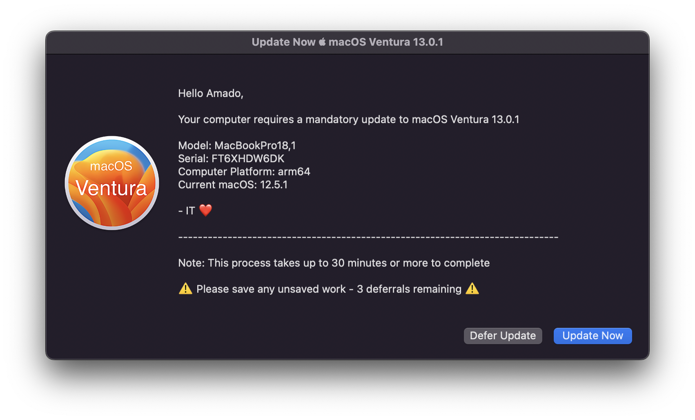
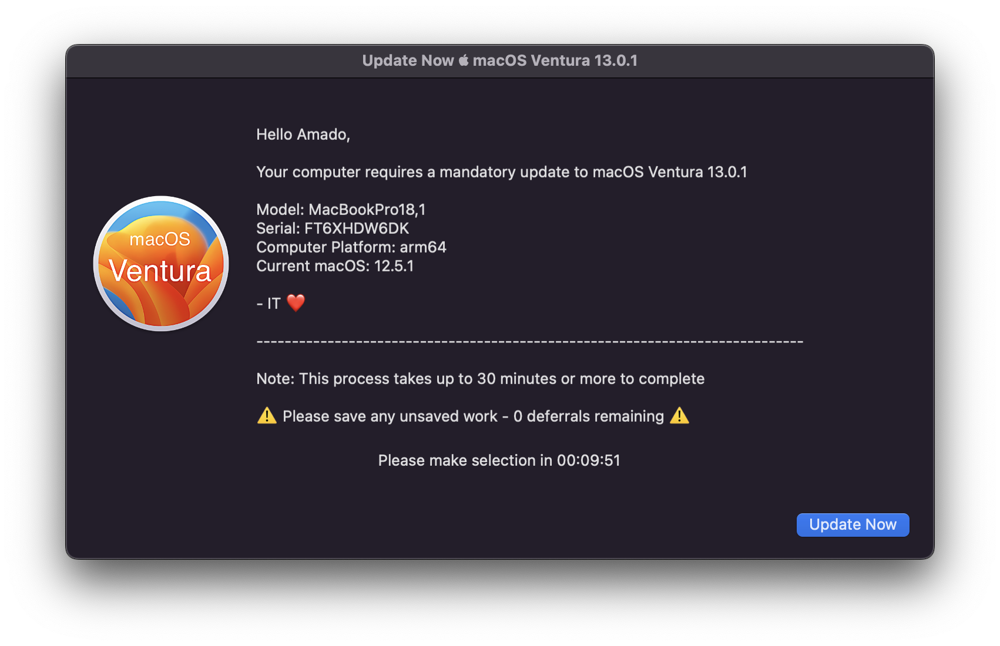
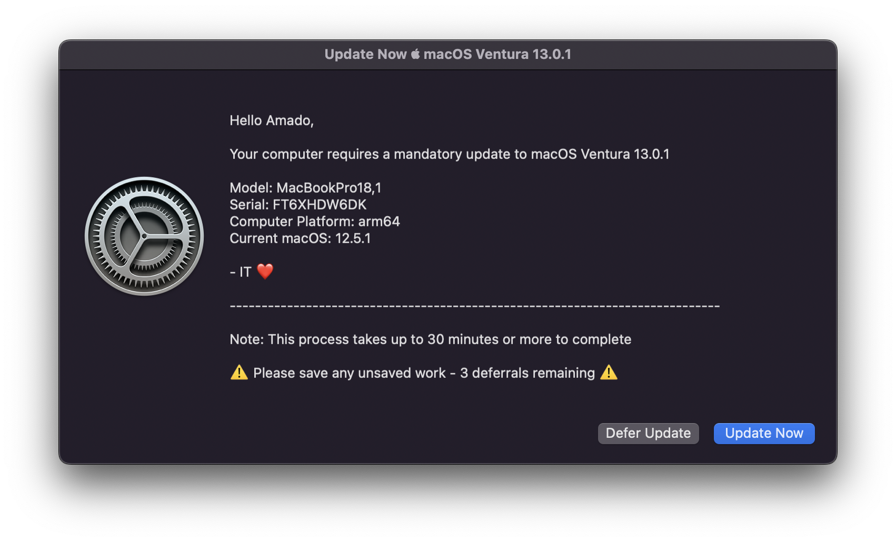
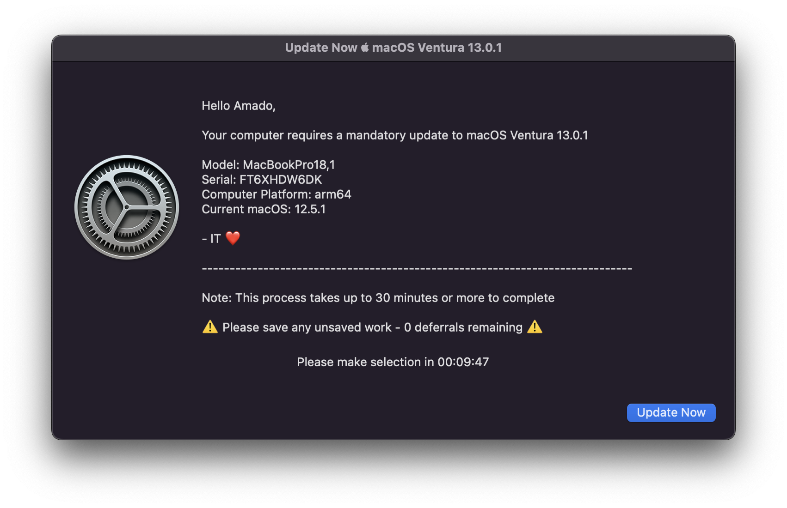
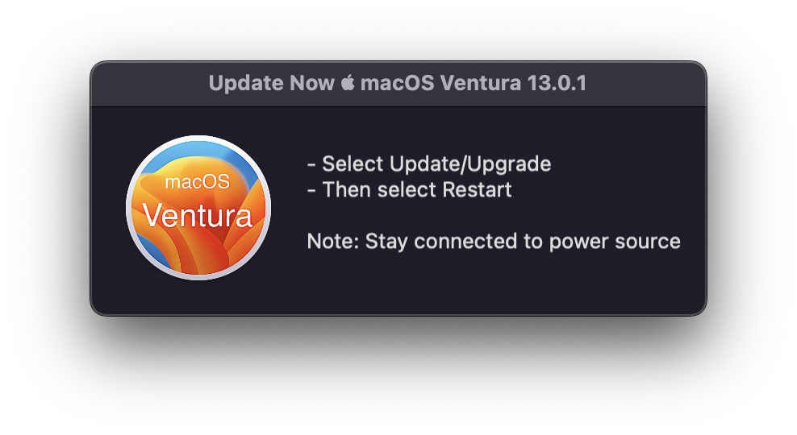

# Tap - macOS Updates
##### Written by [Amado Tejada](https://www.linkedin.com/in/amadotejada/)

## Introduction
macOS Ventura introduces useful new [features](https://developer.apple.com/videos/play/wwdc2022/10045/) to manage macOS updates via an MDM solution. Devices that not on macOS Ventura have limited functionality when it comes to managing macOS updates via MDM, and other solutions are too disruptive for some enterprise environments.

*Tap* is a tool that encourages users to update macOS without aggressively interrupting user workflow.

## Screenshots

With Custom Icon
| Defer Available  | No Deferrals |
|:-----:|:-----:|
|  |  |

With Default Software Update Icon
| Defer Available  | No Deferrals |
|:-----:|:-----:|
|  |  |

## Requirements
-  Jamf Pro
-  Administrator privileges

## Features
* run with bash, no dependencies
* users can defer updates 3x to the next run
* no Jamf Pro API account required
* supports Intel and M1 devices
    * using system preferences to update
    * not using the deprecating `softwareupdate` command
* simply configurable
    * targetos - which version to look for
    * how many times user can defer updates
    * custom image to show on the GUI dialog
    * description of GUI dialog

## Initial Jamf Setup
1. Upload `tap_updates.sh` to the Jamf Pro as a script
2. Create Smart group for endpoints that you want to update
    - Computers not on the *Tap* targeted version
3. Set *Tap* variables in `tap_updates.sh` as needed
    - `macosname` - the name of the macOS version to target e.g. "Monterey"
    - `targetosverion` - which version to check for e.g. "12.15.1"
    - `customicon` - custom icon to show on the GUI dialog
    - `heading` - the heading to show on the GUI dialog
    - `message` - the message to show on the GUI dialog

    Note: Alternatively, can set these as script parameters in Jamf Pro

## Jamf Usage
1. Create a policy that runs *Tap*
2. Set the policy's frequency to "Once every day"
    - Adjust the policy's "Run at" time to your liking
3. Set scope to the Smart group you want to encourage update
4. Profit

## User Experience
1. If the user's macOS version is not the targeted version, the user will be prompted to update to the targeted version. 

2. The user will be able to defer the update 3x times. After 3 deferrals, the user will be prompted to update without the option to defer.

3. The user is instructed to close/save any work, and after 10 minutes, Software Update will automatically open, with a dialog that tells the user select update/Restart.

This will occur every day until the user updates to the targeted version.

## Note: Enforcing updates
Usually not needed because of *Tap* but for those users who needs an extra push or not local admin, you can send APNs remote commands or a policy to force the user to update and restart the compuster. [instant-checkin](https://github.com/amadotejada/instant-checkin) could also be useful for other enforcing solutions.

- DEP enrolled machines - MDM [remote commands](https://docs.jamf.com/best-practice-workflows/jamf-pro/managing-macos-updates/Updating_macOS_Using_a_Mass_Action.html)

- non-DEP enrolled machines - MDM [policy](https://docs.jamf.com/best-practice-workflows/jamf-pro/managing-macos-updates/Running_Software_Update_Using_a_Policy.html)

##
### License

*Tap* is released under the [MIT License](https://github.com/amadotejada/TapmacOS/blob/main/LICENSE)

####
